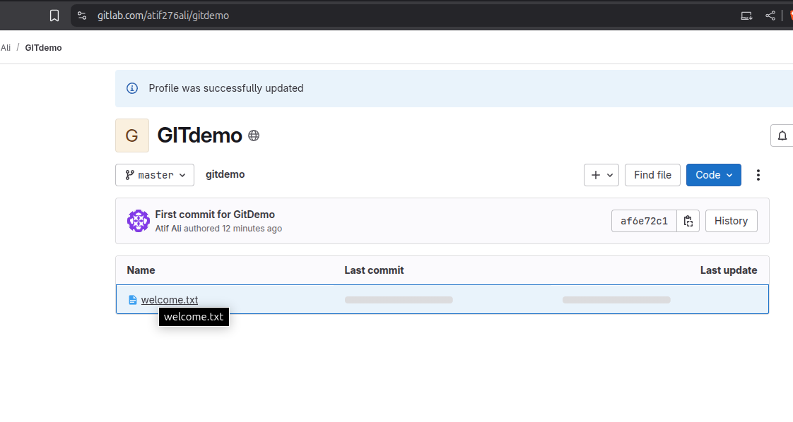
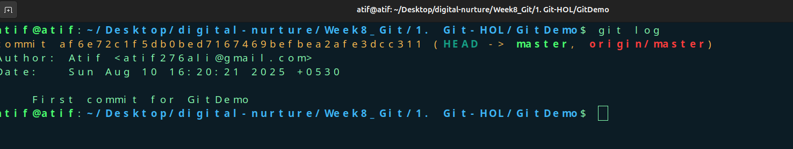
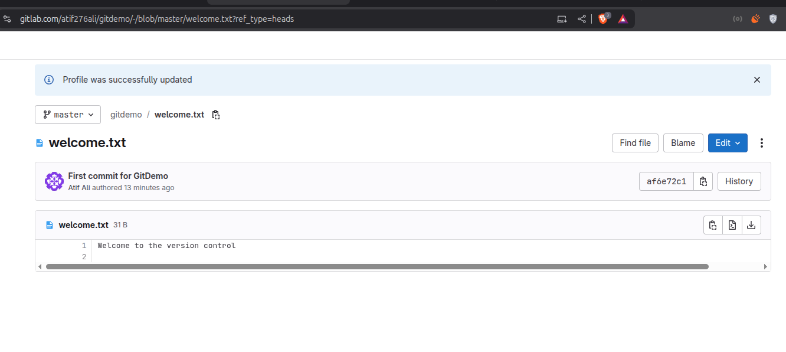

# Git Hands-On Lab 1 

Gitlab Link- https://gitlab.com/atif276ali/gitdemo

 

## Steps

1. **Git Setup**
   - Install Git Bash and verify installation with `git --version`
   - Configure username & email using:
     ```bash
     git config --global user.name "Your Name"
     git config --global user.email "you@example.com"
     ```

2. **Create Local Repo**
   ```bash
   mkdir GitDemo && cd GitDemo
   git init
   echo "Welcome" > welcome.txt
   git add welcome.txt
   git commit

3.**Push to Remote**

4. **Create GitDemo repo on GitLab**

5. **Link and push:**

```
git remote add origin <repo_url>
git pull origin master
git push origin master
```


# Outputs

 

