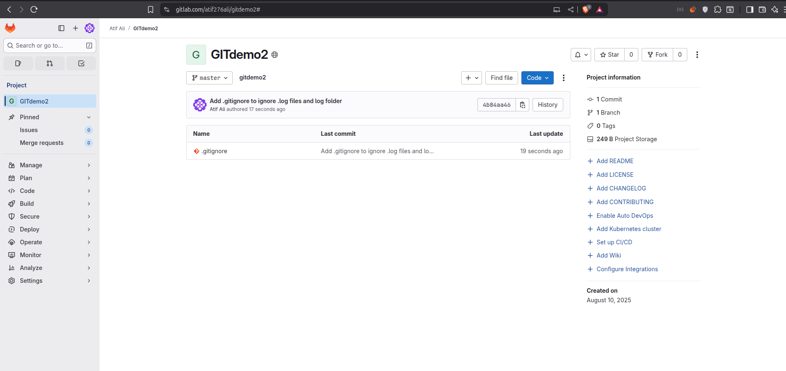
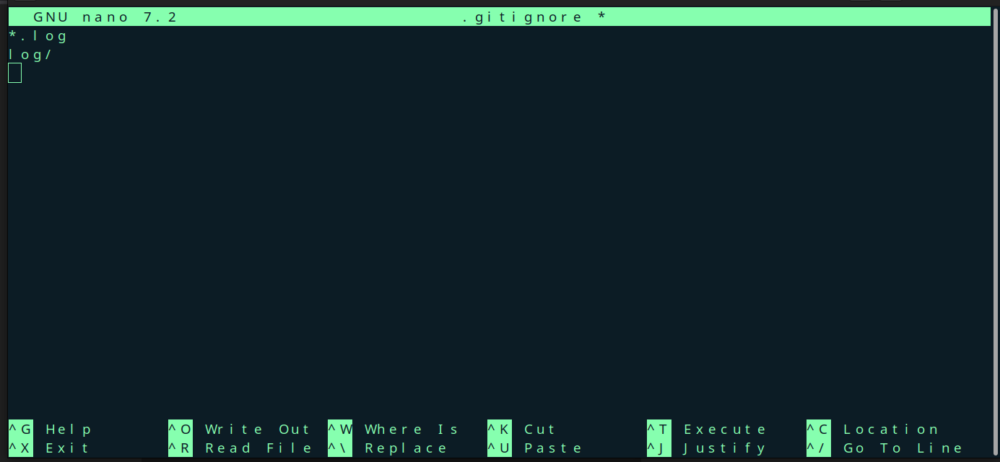
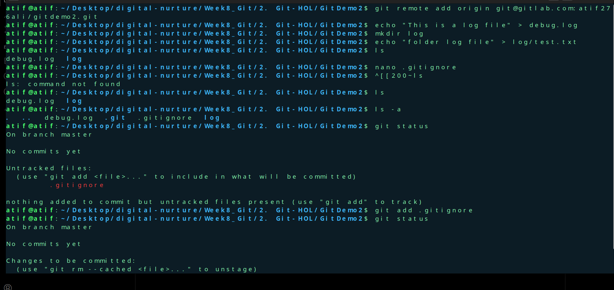

## Git Ignore Lab

Gitlab link- https://gitlab.com/atif276ali/gitdemo2

**Objectives**
## 1. What is `.gitignore`?
- `.gitignore` is a special file in a Git repository that specifies files or folders that Git should **not** track.
- Common uses:
  - Temporary files (e.g., `.log`, `.tmp`)
  - Build outputs (e.g., `dist/`, `target/`)
  - OS-specific files (e.g., `Thumbs.db`, `.DS_Store`)
  - Sensitive data (e.g., `.env` containing API keys)
- Files listed in `.gitignore` exist locally but are **ignored** by Git when staging or committing.

---

## 2. How to Ignore Unwanted Files Using `.gitignore`
1. **Create or edit** the `.gitignore` file in the repository root.
2. **Add ignore patterns**:
   - Ignore all `.log` files:
     ```plaintext
     *.log
     ```
   - Ignore a folder named `log`:
     ```plaintext
     log/
     ```
3. **Save the file** and run:
   ```bash
   git status
   ```
   to verify that the specified files/folders are ignored.


**Lab Task**
1. Create a `.log` file and a `log` folder in your Git working directory.
2. Edit `.gitignore` to ignore:
   - All `.log` files.
   - The `log` folder.
3. Commit changes and verify with `git status` that the specified files/folders are ignored in:
   - Working directory
   - Local repository
   - Remote repository


# Output
  