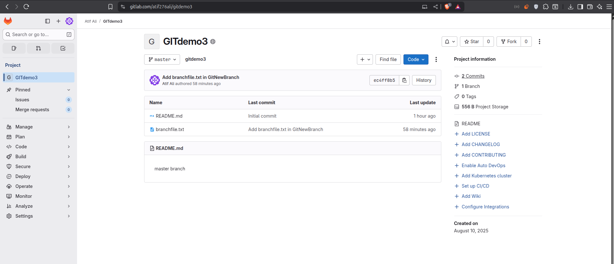
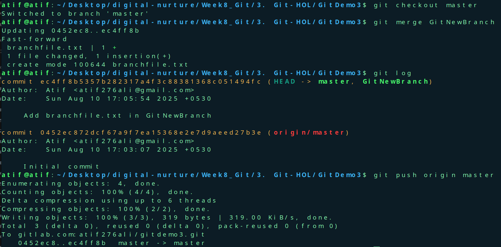

# Branching Lab
Gitlab link- https://gitlab.com/atif276ali/gitdemo3


## Objectives Explanation

### 1. Branching and Merging
- **Branching**: Creating an independent line of development in Git.  
  - Lets you work on new features, bug fixes, or experiments without affecting the `master` (main) branch.
  - Command example:  
    ```bash
    git branch feature-branch
    git checkout feature-branch
    ```
- **Merging**: Combining changes from one branch into another.  
  - Usually merges a feature branch back into `master` after work is complete.
  - Can be done via:
    - **Fast-forward merge** (no divergence).
    - **Three-way merge** (branches have diverged).
  - Command example:  
    ```bash
    git checkout master
    git merge feature-branch
    ```

---

### 2. Creating a Branch Request in GitLab
- In GitLab, a **branch request** typically means **creating a new branch** in the repository.
- This can be done:
  - Locally (with Git commands) and pushed to GitLab.
  - Directly in GitLab’s UI via **Repository → Branches → New Branch**.
- Purpose: To separate changes for review, testing, or collaboration.

---

### 3. Creating a Merge Request in GitLab
- A **Merge Request (MR)** is GitLab’s way of proposing changes from one branch into another.
- Steps:
  1. Push your branch to GitLab.
  2. Go to **Merge Requests → New Merge Request**.
  3. Select source branch (your branch) and target branch (e.g., `master`).
  4. Add a title, description, and reviewers.
  5. Submit the request for code review and approval.
- Purpose: Allows collaboration, code review, and approval before merging changes.


# Output

