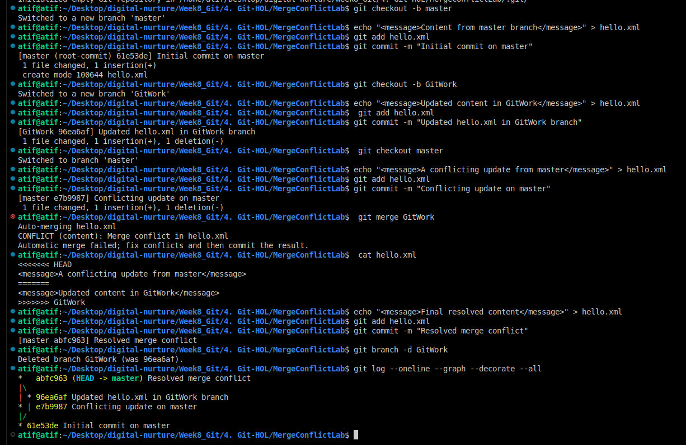

## Resolving Merge Conflicts in Git


# Output


A merge conflict happens when Git cannot automatically combine changes from two branches because the same part of a file was modified differently.

---

### Steps to Resolve

1. **Identify the Conflict**
   ```bash
   git merge branch-name
   git status
   ```
   Git stops the merge and lists conflicted files.

2. **Open the Conflicted File**
   ```plaintext
   <<<<<<< HEAD
   Current branch changes
   =======
   Incoming branch changes
   >>>>>>> branch-name
   ```

3. **Resolve the Conflict**
   - Keep current changes, incoming changes, or combine both.
   - Remove all conflict markers (`<<<<<<<`, `=======`, `>>>>>>>`).

4. **Mark as Resolved**
   ```bash
   git add filename
   ```

5. **Complete the Merge**
   ```bash
   git commit
   ```

6. **Verify**
   ```bash
   git log --oneline --graph --decorate
   ```

---