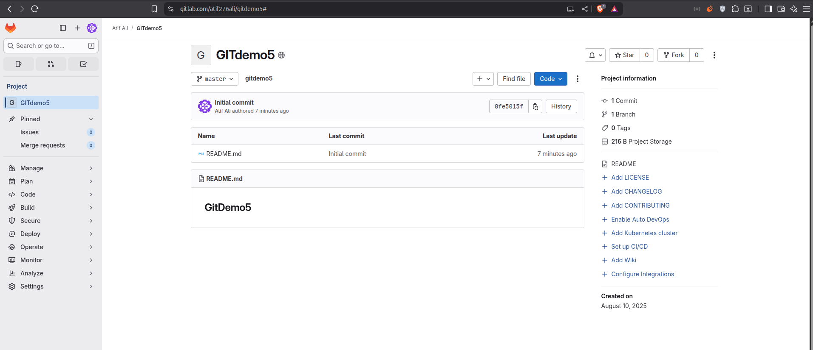
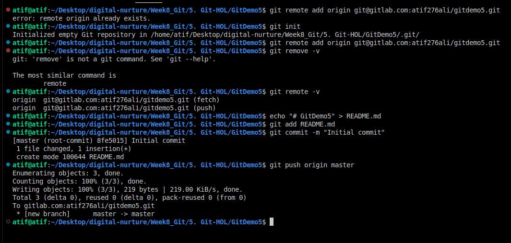

# Git Hands-On Lab 5

Gitlab link-https://gitlab.com/atif276ali/gitdemo5

## How to Clean Up and Push Back to Remote Git

The lab focused on synchronizing a local Git repository with a remote one, ensuring the work is backed up and accessible online.

1. Verify branch is clean, switch to master, and check status:
   git checkout master
   git status

2. Pull latest changes from remote:
   git pull origin master

3. Push local changes to remote:
   git push origin master

# Output
 
